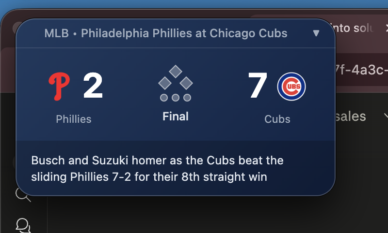
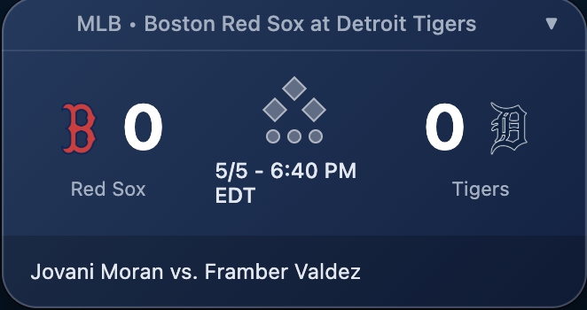

# MLB Score Widget

A real-time MLB scoreboard that floats above all your other windows so
you never have to switch tabs to check the score.

## Features

- Live scores updated every 30 seconds via ESPN API
- Switch between any game currently in progress
- Right-click to enable Always on Top
- Right-click to lock position on screen

## Install

1. Download the latest `.dmg` from [Releases](link)
2. Open the `.dmg` and drag to Applications
3. Launch MLB Score Widget

> Note: App is unsigned. On first launch right-click → Open to bypass
> the macOS security warning.

## Built With

- Electron
- ESPN Scoreboard API
